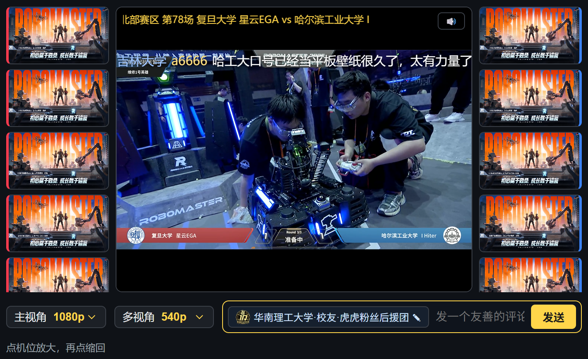

# rm-multiview · RoboMaster 多视角直播间

纯前端重做的 RoboMaster 赛事多视角直播间：同时播 **11 路**官方真实直播流（主视角 + 红蓝各 5 机位），复刻其 **LeanCloud 弹幕**（十周年徽章 / 学校 / 身份 / 正文，红金两色），支持匿名自填身份发弹幕；第二屏内嵌社区工具站（赛程 / 天梯榜）+ 聊天室。**无后端**。

体验地址1: http://8.134.153.137

体验地址2: https://rm-multiview.vercel.app/



> ⚠️ 赛事是赛季性的：仅在**有直播时段**（`live_game_info.json` 存在 `liveState===1` 的赛区）能正常加载，否则显示「本场直播已结束」。开发/测试靠 `src/fixtures/` 离线进行。

## 运行

```bash
npm install
npm run dev      # http://localhost:5173 —— 自动连接当前直播赛区
npm run test     # 43 个单测（Vitest）
npm run build    # 生产构建（tsc -b && vite build → dist/）
npm run lint     # ESLint
```

打开后：主视角左上「🔇」解锁解说音；点机位原地放大、再点缩回（红蓝可各放大一个）；下滚到第二屏是内嵌站 + 聊天室，填好身份即可发弹幕。窗口太窄时第一屏会提示「请在大屏幕上观看」，第二屏会改为上下堆叠。

## 技术栈与架构

React 19 + Vite + TypeScript；Vitest + Testing Library；hls.js；leancloud-realtime。三处数据源实测均 `Access-Control-Allow-Origin: *`，故**零代理纯前端**：

- **视频**：`hls.js × 11` 跨域直拉 `rtmp.djicdn.com`。流目录 + 当前直播赛区 + 三档清晰度签名源，全来自 `rm-static.djicdn.com/.../live_game_info.json`（取 `liveState===1` 赛区，按 `role` 过滤掉合集/无解说）。每次进入实时 fetch → 签名新鲜；签名过期(403) → 重取换源。
- **弹幕**：`leancloud-realtime` 匿名连接，用赛区 `chatRoomId` 入瞬态聊天室，收发 `TextMessage`；入会回填历史，断线重连后重入会。
- **身份**：`localStorage` 持久化，自填（UI 提示「文明发言」）。

```
src/
  config.ts                # LeanCloud 公钥、URL、清晰度、颜色、过滤词
  types.ts
  data/    danmaku|catalog|streams.ts   # 纯函数：弹幕模型/颜色/标签、目录解析、选源、签名分类
  hooks/   useProfile|useDanmaku|useCatalog|useHlsPlayer.ts
  net/     leancloud.ts     # 连接(单例缓存)/收发/历史/重连
  singleFlight.ts           # 并发去重（N 路同时 403 只重取一次）
  components/               # LiveStage/SideColumn/ViewTile/MainStage/DanmakuOverlay/
                            #   ChatRoom/MessageItem/DanmakuComposer/ReservedPanel(内嵌Tab)/…
  fixtures/                 # 真实抓包样本，供离线单测
recon/                      # 逆向抓包脚本与产物（Playwright + 被动监听探针）
docs/                       # 设计文档(specs) / 实现计划(plans) / 会话纪要
```
